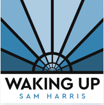
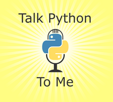
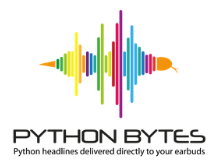



Whenever I have time, I listen to podcasts. Currently, my favorite podcasts are the following:

   
   
**Skeptics Guide to the Universe**
   
The skeptics guide is a weekly science podcast hosted by Steven Novella. It promotes the love for science and critical thinking, discussing the latest science news, critical thinking, bad science, conspiracies and controversies.
   
[Click here for podcast website](https://www.theskepticsguide.org/)
   
---
   
   
**The Waking Up Podcast**
   
Weekly podcast hosted by Sam Harris, in which he discusses a variety of questions about the human mind, society, and current events, usually with an expert guest.   

[Click here for podcast website](https://samharris.org/podcast/)
   
---
   
   
**Talk Python To Me**
    
Weekly podcast hosted by Michael Kennedy. The episodes are usually casual conversations with industry experts and cover a wide array of Python topics.

[Click here for podcast website](https://talkpython.fm/)   
   
---
   
   
**Python Bytes**
    
Weekly podcast on Python news hosted by Michael Kennedy and Brian Okken. 

[Click here for podcast website](https://pythonbytes.fm/)   
   
---
   
   
**Intelligence Squared US Debates**

Weekly podcast of live-debates covering a wide variety of topics, inluding education, politics and science.

[Click here for podcast website](https://www.intelligencesquaredus.org/)   

---
   
   
   
**This Week in Machine Learning & AI**
   
Weekly podcast by Sam Charrington. Discusses current topics and projects related to machine learning, deep learning and artificial intelligence.
   
[Click here for podcast website](https://twimlai.com/)   
