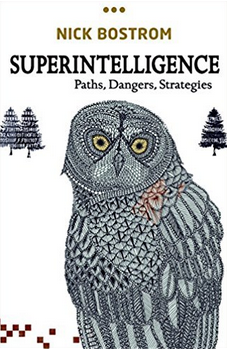
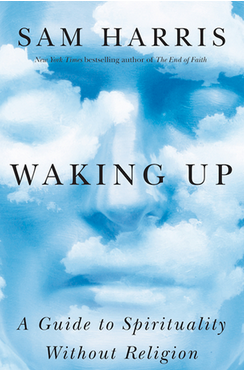
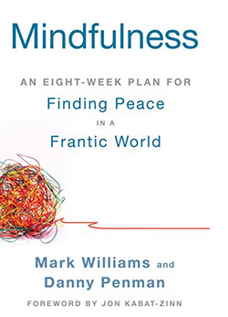



## (Non-fiction) books I am currently reading

[Superintelligence: Paths, Dangers, Strategies](https://www.amazon.com/gp/product/0198739834/ref=as_li_qf_sp_asin_il_tl?ie=UTF8&tag=nbostrom0c-20&camp=1789&creative=9325&linkCode=as2&creativeASIN=0198739834&linkId=37a8c8afb67a781338095992bd0b4ed6) by Nick Bostrom

## (Non-fiction) books I have read

[Waking Up](https://samharris.org/books/waking-up/) by Sam Harris

[Finding Peace in a Frantic World](https://www.amazon.com/Mindfulness-Eight-Week-Finding-Peace-Frantic-ebook/dp/B005NJ2T1G/ref=tmm_kin_swatch_0?_encoding=UTF8&qid=&sr=)

## (Non-fiction) books I want to read
