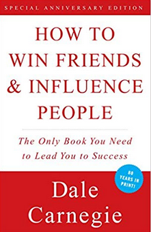
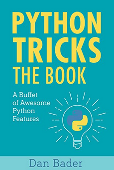
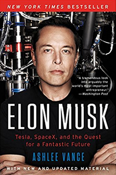
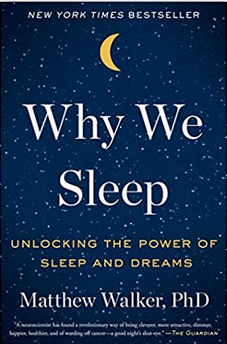
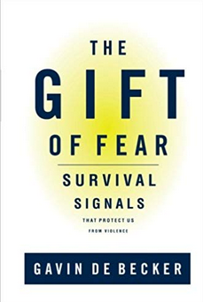
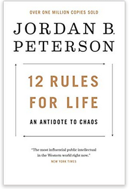



## Books I am currently reading

   
**Superintelligence: Paths, Dangers, Strategies** by Nick Bostrom     
[Click here for link to book](https://www.amazon.com/gp/product/0198739834/ref=as_li_qf_sp_asin_il_tl?ie=UTF8&tag=nbostrom0c-20&camp=1789&creative=9325&linkCode=as2&creativeASIN=0198739834&linkId=37a8c8afb67a781338095992bd0b4ed6) 

   
**How to Win Friends & Influence People** by Dale Carnegie   
[Click here for link to book](https://www.amazon.com/How-Win-Friends-Influence-People/dp/0671027034) 

   
---
## Books I have read

   
**Waking Up** by Sam Harris   
[Click here for link to book](https://samharris.org/books/waking-up/)   

    
**Python Tricks: A Buffet of Awesome Python Features** by Dan Bader   
[Click here for link to book](https://www.amazon.com/Python-Tricks-Buffet-Awesome-Features/dp/1775093301)   

    
**Finding Peace in a Frantic World** by Mark Williams and Danny Penman    
[Click here for link to book](https://www.amazon.com/Mindfulness-Eight-Week-Finding-Peace-Frantic-ebook/dp/B005NJ2T1G/ref=tmm_kin_swatch_0?_encoding=UTF8&qid=&sr=)    

    
**Elon Musk: Tesla, SpaceX, and the Quest for a Fantastic Future** by Ashlee Vance   
[Click here for link to book](https://www.amazon.com/Elon-Musk-SpaceX-Fantastic-Future/dp/006230125X)   

---

## Books I want to read (an will!)

   
   
**Why We Sleep: Unlocking the Power of Sleep and Dreams** by Matthew Walker   
[Click here for link to book](https://www.amazon.com/Why-We-Sleep-Unlocking-Dreams/dp/1501144316)    
     
[Great podcast episode about the book](http://podcastnotes.org/2018/04/29/why-we-sleep/) (podcast: the Joe Rogan experience)   
   
   
     
**The Gift of Fear - Survival Signals That Protect Us from Violence** by Gavin de Becker      
[Click here for link to book](https://www.amazon.com/Gift-Fear-Survival-Signals-Violence/dp/0316235024/ref=tmm_hrd_swatch_0?_encoding=UTF8&qid=&sr=)    
     
[Great podcast episode about the book](https://samharris.org/podcasts/living-with-violence/)   
   
    
    
**12 Rules for Life: An Antidote to Chaos** by Jordan B. Peterson    
[Click here for link to book](https://www.amazon.com/12-Rules-Life-Antidote-Chaos/dp/0345816021/ref=sr_1_3?ie=UTF8&qid=1532660160&sr=8-3&keywords=jordan+peterson)    

## And what about other books?

I love reading and I read a lot of "other" books. Listing all of them would probably exhaust the size of this page. 
