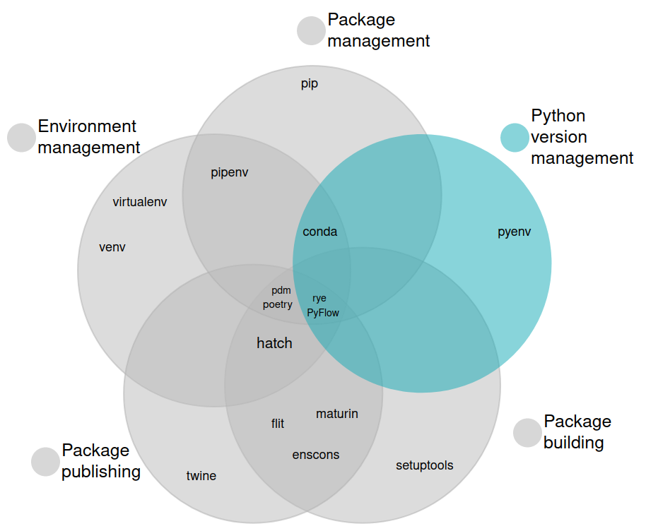
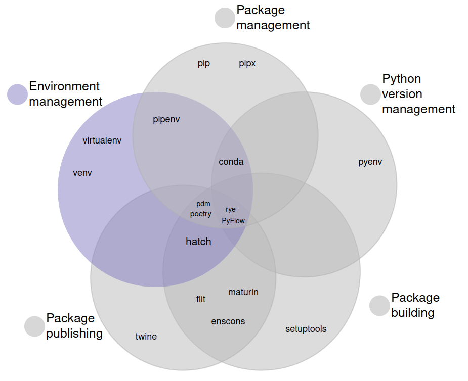
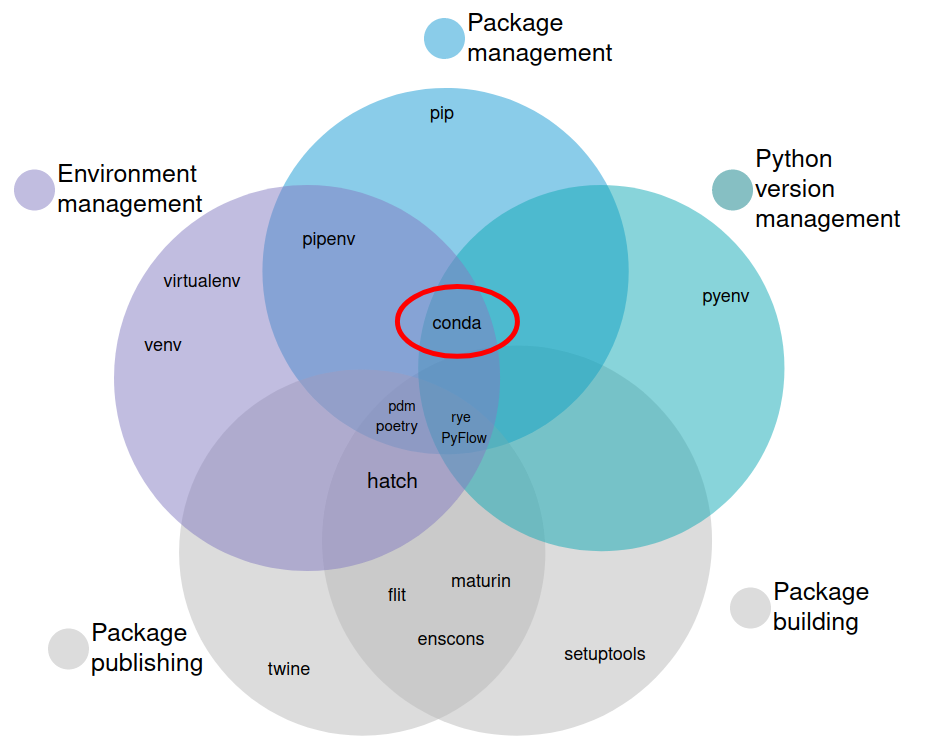
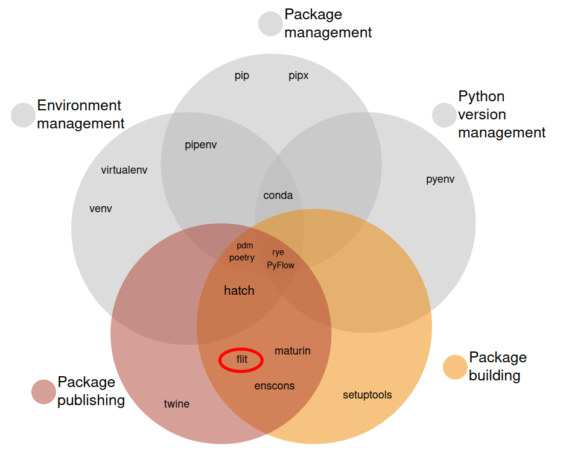
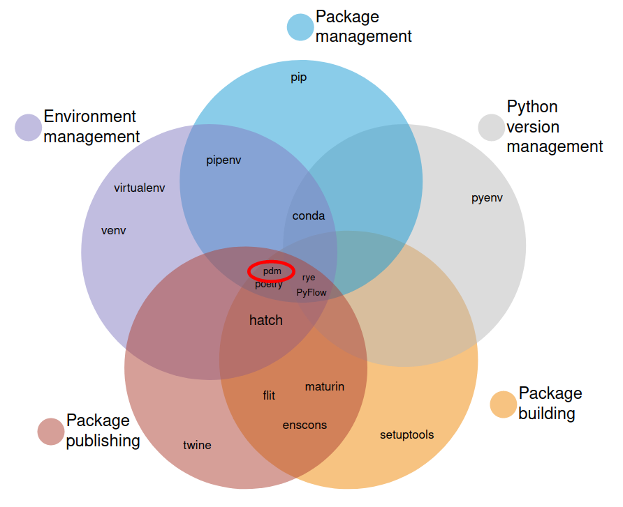
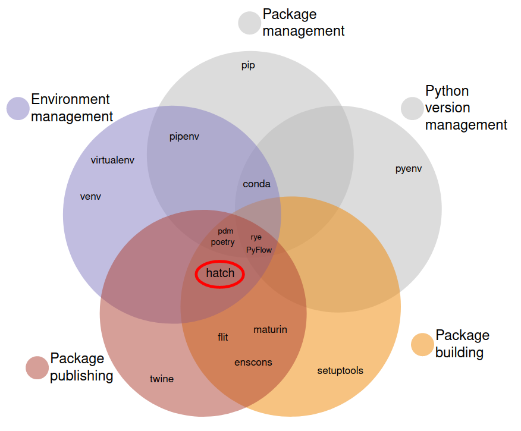

**Topics:** An unbiased evaluation of environment management and packaging tools

## Motivation
When I started with Python and created my first package I was confused. Creating and managing a package seemed much harder than I expected. In addition, multiple tools existed and I wasn't sure which one to use. I'm sure most of you had the very same problem in the past. Python has a zillion tools to manage virtual environments and create packages and it can be hard (or almost impossible) to understand which one fits your needs. Several talks and blog post on the topic exist, but none of them gives a complete overview or evaluates the tools in a structured fasion. This is what this post is about. I want to give you a truly unbiased evaluation of existing packaging and environment management tools. In case you'd rather watch a talk, take a look at the recording of [PyCon DE 2023](https://www.youtube.com/watch?v=MsJjzVIVs6M).

## Categorization

For the purpose of the talk I identified five main categories that are important:
- Python version management
- Environment management (which is mostly concerned with virtual environments)
- Package management
- Package building
- Package publishing

As you can see in the figure below, lots of tools exist. Some can do a single thing (i.e. they are single-purpose), others can perform multiple tasks (hence I call them multi-puprose tools). 


Let's walk through the categories keeping a developers perspective in mind. Let's say you are working on a personal project alongside your work projects. At work you're using Python 3.7 whereas your personal project should be using the newest Python version (currently 3.11). In other words: you want to be able to install different Python versions and switch between them. That's what our first category, **Python version management** is about. Within your projects you are using other packages (e.g. `pandas` or `sklearn` for data science). These are dependencies of your project that you have to install and manage (e.g. upgrade when new versions are released). This is what **package management** is about. Because different projects might require different versions of the same package you need to create (and manage) virtual environments to avoid dependency conflicts. Tools for this are collected in the category **environment management**. Most tools use virtual environments, but some use another concept called "local packages" which we will look at later. Once your code is in a proper state you might want to share it with fellow developers. For this you first have to build your package (**package building**) before you can publish it to PyPi or another index (**package publishing**).

In the following we will look at each category in more detail, including a short definition, motivation and the available tools. I will present some single-purpose tools in more detail and several multi-purpose tools in a separate section at the end. Let's get started with the first category: Python version management.

## Python version managment

### Definition
A tool that can perform Python version management allows you to install Python versions and switch between the versions easily.

### Motivation
Why would we want to use different Python versions? There are several reasons. For example, you might be working of several projects where each projects requires a different Python version. Or you might develop a project that supports several Python versions and you want to test all of them. Besides that it can be nice to check out what the newest Python version has to offer, or test a pre-release version of Python for bugs. 

### Tools


#### pyenv
Python has one single-purpose tool that lets you install and manage Python versions: `pyenv`! Pyenv is easy to use. The most important commands are the following:
```bash
# Install specific Python version
pyenv install 3.10.4

# Switch between Python versions
pyenv shell <version>
pyenv local <version>
pyenv global <version>
```

## (Virtual) environment management

### Definition
A tool that can perform enviornment management allows you to create and manage (virtual) environments.

### Motivation
Why do we want to use environments in the first place? As mentioned in the beginning, projects have specific requirements (i.e. they depend on other packages). It's often the case that different projects require different versions of the same package. This can cause depenency conflicts. In addition, problems can occur when using `pip install` to install a package because the package is placed with your system-wide Python installation (e.g. system pollution). Some of these problems can be solved by using the `--user` flag. However, this option might not be known to everyone, especially beginners. Python has two main single-purpose tools that can be used to manage virtual envs: `venv` and `virtualenv`. Let's look at both of them in more detail.

### Tools


### venv
`venv` is the built-in Python package for creating virtual environments. This means that it is shipped with Python and does not have to be installed by the user. The most important commands are the following:
```bash
# Create env
python3 -m venv <env_name>

# Activate env 
source <env_name>/bin/activate

# Deactivate env
deactivate
```

### virtualenv
`virtualenv` tries to improve `venv`. It offers more features than `venv` and is faster and more powerful. The most important commands are similar to the ones of `venv`, only creating a new environment is cleaner:
```bash
# Create env
virtualenv <env_name>

# Activate env 
source <env_name>/bin/activate

# Deactivate env
deactivate
```

## Recap I - `pyproject.toml`

Before we can talk about packaging I want to make sure that you are aware of the most important file for packaging: `pyproject.toml`.

Packaging in Python has come a long way. Until PEP 518 `setup.py` files where used for packaging, using `setuptools` as a build tool. PEP 518 introduced the usage of a `pyproject.toml` file. So right now, when creating a package we need a pyproject.toml file. It is used to define the settings of a project, set metadata and lots of other things. If you would like to see an example check out the [`pyproject.toml` file of the pandas library](https://github.com/pandas-dev/pandas/blob/main/pyproject.toml).

With this knowledge we can go on at take a look at package management.

## Package management
### Definition
A tool that can perform package management is able to download and install libraries and their dependencies. 

### Motivation
- Packages allow us to define a hierarchy of modules
- Modules can be accessed easily using the dot-syntax
- Code can easily be shared with other developers
- Project dependencies are bundled in `pyproject.toml`

Why do we care about packages? Packages allow us to define a hierarchy of modules and to access modules easily using the dot-syntax (`from package.module import my_function`). In addition, they make it easy to share code with other developers. Since each package as a `pyproject.toml` file which defines its dependencies, other developers don’t have to install the required packages separately but can simply install the package from its `pyproject.toml` file. 

### Tools


#### pip
The standard package manager for Python is `pip`. It's shipped with Python and allows you to install packages from PyPI and other indexes. The main command (probably one of the first commands a Python developer learns) is `pip install <package_name>`.

## Recap II - lock file
Before we go on to the multi-purpose tools, there is one more file that's important for packaging: the lock file. While `pyproject.toml` contains abstract dependencies, the lock file contains concrete dependencies. It records exact versions of all dependencies installed for a project. This enables reproducability of projects across multiple platforms. If you have never seen a lock file before, take a look at [this one from `poetry`](https://github.com/python-poetry/poetry/blob/master/poetry.lock):


## Multi-purpose tools

### Pipenv


As the name suggests, [`pipenv`](https://pipenv.pypa.io/en/latest/) combines `pip` and `virtualenv`. It allows you to perform virtual environment management and package managementby introducing two additional files:
- `Pipfile`
- `Pipfile.lock`

`Pipfile` is a TOML file (similar to `pyproject.toml`) used to define project dependencies. It is managed by the developer when she invokes pipenv commands (like `pipenv install`). `Pipfile.lock` allows for deterministic builds. It eliminates the need for a `requirements.txt` file and is managed automatically through locking actions .

The most important `pipenv` commands are:
```bash
# Install package
pipenv install <package_name>

# Run Python script within virtual env
pipenv run <script_name.py>

# Activate virtual env
pipenv shell
```

### Conda



Conda is a general-purpose package management system. That means that it's not limited to Python packages. Conda is a huge tool with lots of capabilities. Lot's of tutorials and blog posts exist (for example [the official one](https://conda.io/projects/conda/en/latest/user-guide/getting-started.html#managing-python)) so I won't go into more detail here. 

### Feature evaluation
Last but not least we will take a look at multi-purpose tools for packaging. I promised an unbiased evaluation. For this purpose I created a list of features that are important when comparing the different tools. The features are the following:

| |  |    
| --------------                       |--|   
| Manages dependencies                 |? |   
| Resolves/locks dependencies          |? |   
| Clean build/publish flow             |? |   
| Allows to use plugins                |? |   
| Supports PEP 660 (editable installs) |? |    
| Supports PEP 621 (project metadata)  |? |   

Regarding the two PEPs: Python has a lot of open and closed PEPs on packaging. For a full overview take a look at [this page](https://peps.python.org/topic/packaging/). I only included PEP 660 and PEP 621 for specific reasons:
- [PEP 660](https://peps.python.org/pep-0660/) is about editable installs for pyproject.toml based builds. When you install a package using `pip` you have the option to install it in editable mode using `pip install -e package_name`. This is an important features to have when you are developing a package and want your changes to be directly reflected in your environment.
- [PEP 621](https://peps.python.org/pep-0621/) specifies how to write a project’s core metadata in a pyproject.toml file. I added it because one package (spoiler: it's `poetry`) currently does not support this PEP but uses its own way for declaring metadata.

### Flit
[Flit](https://flit.pypa.io/en/stable/) tries to create a simple way to put Python packages and modules on PyPI. It has a very specific use case: it's meant to be used for packaging pure Python packages (that is, packages without a build step). It doesn't care about any of the other tasks (Python version management, etc.). This is also reflected in the feature evaluation below.



#### Flit - Capabilities
- Python version management: ❌
- Package management: ❌
- Environment management: ❌
- Building a package: ✅
- Publishing a package: ✅

#### Flit - Feature evaluation
| |  |    
| -------                       |--|   
| Manages dependencies          | ❌|   
| Resolves/locks dependencies   | ❌|   
| Clean build/publish flow      | ✅|   
| Allows to use plugins         | ❌|
| Supports PEP 660 (editable installs) |✅|    
| Supports PEP 621 (project metadata)  |✅|   

#### Flit - Main commands
```bash
# Create new pyproject.toml
flit init

# Build and publish 
flit publish
```

### Poetry


#### Poetry - Capabilities
- Python version management: ❌
- Package management: ✅
- Environment management: ✅
- Building a package: ✅
- Publishing a package: ✅

#### Poetry - Feature evaluation
| |  |    
| -------                       |--|   
| Manages dependencies          | ✅|   
| Resolves/locks dependencies   | ✅|   
| Clean build/publish flow      | ✅|   
| Allows to use plugins         | ✅| 
| Supports PEP 660 (editable installs) |✅|    
| Supports PEP 621 (project metadata)  |❌||   


#### Poetry - Main commands
```bash
# Create directory structure and pyproject.toml
poetry new <project_name>

# Create pyproject.toml interactively
poetry init

# Install package from pyproject.toml
poetry install
```

#### Poetry - Dependency management
```bash
# Add dependency
poetry add <package_name>

# Display all dependencies
poetry show --tree
```

#### Poetry - Running code
```bash
# Activate virtual env
poetry shell

# Run script within virtual env
poetry run python <script_name.py>
```

#### Poetry - Lock file
- When installing package, poetry resolves its dependencies and creates `poetry.lock`
- Updating dependencies to latest versions with `poetry update`

## Poetry - Build/publish flow
```bash
# Package code (creates `.tar.gz` and `.whl` files)
poetry build

# Publish to PyPi
poetry publish 
```

### PDM


#### PDM - Capabilities
- Python version management: ❌
- Package management: ✅
- Environment management: ✅
- Building a package: ✅
- Publishing a package: ✅

#### PDM
- Strongly inspired by `poetry` and `pyflow`
- Requires Python 3.7 or higher
- Implements PEP 582 (local packages)
- PEP 582 ("local packages"): https://peps.python.org/pep-0582/
- Was rejected
- Allows users to choose build backend

#### PDM - Feature evaluation
| |  |    
| -------                       |--|   
| Manages dependencies          | ✅|   
| Resolves/locks dependencies   | ✅| 
| Clean build/publish flow      | ✅|   
| Allows to use plugins         | ✅| 
| Supports PEP 660 (editable installs) |✅|    
| Supports PEP 621 (project metadata)  |✅|   

#### Main commands
```bash
# Create pyproject.toml interactively
pdm init

# Install package from pyproject.toml
pdm install
```

#### Dependency management
```bash
# Add dependency
pdm add <package_name>

# Display all dependencies
pdm list --graph
```

#### Running code
```bash
# No pdm shell command 

# Run script within env
pdm run python <script_name.py>
```

#### Lock file
- Similar to poetry
- When installing package, pdm resolves its dependencies and creates `pdm.lock`
- Updating dependencies to latest versions with `pdm update`

#### Build/publish flow
```bash
# Package code (creates `.tar.gz` and `.whl` files)
pdm build

# Publish to PyPi
pdm publish 
```

### Hatch


#### Hatch - Capabilities
- Python version management: ❌
- Package management: ❌
- Environment management: ✅
- Building a package: ✅
- Publishing a package: ✅

#### Hatch - Feature evaluation
| |  |    
| -------                       |--|   
| Manages dependencies          | ❌|   
| Resolves/locks dependencies   | ❌|   
| Clean build/publish flow      | ✅|   
| Allows to use plugins         | ✅| 
| Supports PEP 660 (editable installs) |✅|    
| Supports PEP 621 (project metadata)  |✅|   

#### Hatch - Creating a new project
```bash
# Create directory structure and pyproject.toml
hatch new <project_name>

# Interactive mode
hatch new -i <project_name>

# Initialize existing project / create pyproject.toml
hatch new --init
```

#### Hatch - Dependency management
```python
# Packages are added manually to pyproject.toml
hatch add <package_name> # This command doesn't exist!

# Display dependencies
hatch dep show table
```

#### Hatch - Running code
```bash
# Activate virtual env
hatch shell

# Run script within virtual env
hatch run python <script_name.py>
```

#### Hatch - Build/publish flow
```bash
# Package code (creates `.tar.gz` and `.whl` files)
hatch build

# Publish to PyPi
hatch publish 
```

#### Hatch - Declarative environment management
- Environments can be configured within `pyproject.toml`
- We can define scripts for an environment 
- Example use case: [code formatting](https://hatch.pypa.io/1.1/config/environment/#scripts)

### Rye


#### Rye - Capabilities
- Python version management: ✅
- Package management: ✅
- Environment management: ✅
- Building a package: ✅
- Publishing a package: ✅

#### Rye
- Very new (first release May 2023)
- Inspired by rustup and cargo from Rust
- Written in Rust

#### Rye - Feature evaluation
| |  |    
| -------                       |--|   
| Manages dependencies          | ✅|
| Resolves/locks dependencies   | ✅|
| Clean build/publish flow      | ✅|   
| Allows to use plugins         | ❌|
| Supports PEP 660 (editable installs) |✅|    
| Supports PEP 621 (project metadata)  |✅|   

#### Rye - Creating a new project
```bash
# Create directory structure and pyproject.toml
rye init <project_name>

# Pin a Python version
rye pin 3.10
```

#### Rye - Dependency management
```python
# Add dependency - this does not install the package!
rye add <package_name>

# Synchronize virtual envs, lock file, etc.
# This install packages and Python versions
rye sync
```

#### Rye - Running code
```bash
# Activate virtual env
rye shell

# Run script within virtual env
rye run python <script_name.py>
```

#### Rye - Build/publish flow
```bash
# Package code (creates `.tar.gz` and `.whl` files)
rye build

# Publish to PyPi
rye publish 
```

### Overview
|                               |`flit`  |`poetry`| `pdm`  | `hatch`| `rye` |
| -------                       |--------|--------|--------|--------|-------|
| Manages dependencies          | ❌     | ✅     | ✅     | ❌     |  ✅   |
| Resolves/locks dependencies   | ❌     | ✅     | ✅     | ❌     |  ✅   |   
| Clean build/publish flow      | ✅     | ✅     | ✅     |  ✅    |  ✅   |  
| Supports plugins              | ❌     | ✅     | ✅     | ✅     |  ❌   | 
| PEP 660 (editable installs)   | ✅     | ✅     | ✅     | ✅     |  ✅   |    
| PEP 621 (project metadata)    | ✅     | ❌     | ✅     | ✅     |  ✅   |

